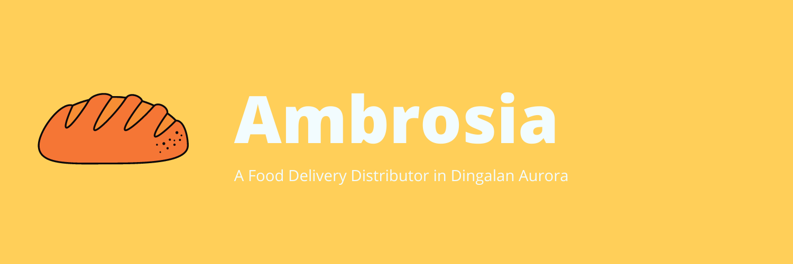

  

    <h1>Ambrosia</h1>

 

    The Ambrosia is a food develivery application. It helps the client manage their food distribution.
 

    <h2>Motivation</h2>

The **Ambrosia** project is created to solve food distribution in the community of Dingalan, Aurora.

    <h2>Screenshot</h2>

    Not yet available

    <h2>Tools used</h2>

- React Native Framework
- Java and TypeScript
- Node, and React Native Paper

    <h2>Code Example</h2>

    Not yet available

    <h2>Installation</h2>

1. git clone https://github.com/workpebojot/Ambrosia.git
2. cd Ambrosia
3. git init
4. npm install

    <h2>How to use</h2>

In order to use this app, you have two options, you can use either use AVD or ADB support. To setup AVD, you can head to AVD Manual Guide at Android Developer Website: [Create New AVD](https://developer.android.com/studio/run/managing-avds.html). To setup ADB, plug in your devices and run `react-native run-android`. However, since this app is still new, I'm not still sure if `react-native run-ios` will run correctly. But it will sure it can be configured for right patching.

    <h2>Contribute</h2>

I would like to invite everyone interested to expand on this simple project. If you are interested, kindly hit [here](https://github.com/workpebojot/Ambrosia/blob/master/CONTRIBUTE.md)
